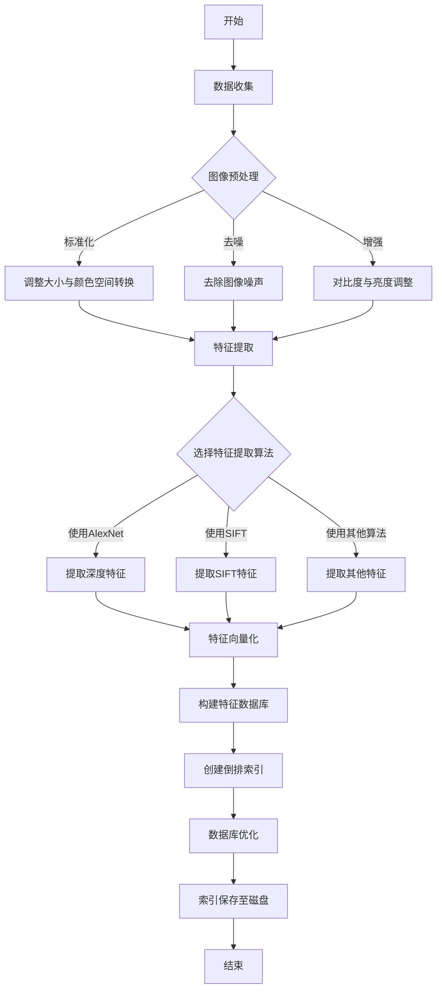
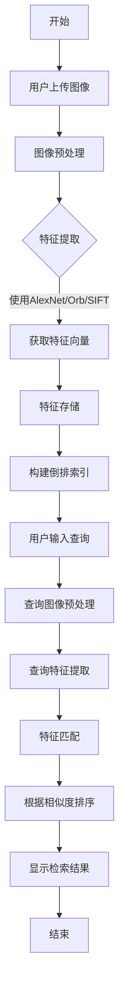

# 基于图像特征提取的图像检索系统

欢迎来到本项目的README文件，这里提供了关于如何使用和理解本图像检索系统的详细信息。

## 项目简介
本项目引用深度学习技术实现的图像检索系统项目[scalable-recognition-with-a-vocabulary-tree](https://github.com/epignatelli/scalable-recognition-with-a-vocabulary-tree)。系统利用AlexNet等模型作为特征提取器，能够快速准确地检索出与查询图像相似的图像。

## 关键词
- 图像检索
- 深度学习
- AlexNet
- SIFT(Scale-invariant feature transform,尺度不变特征转换)
- ORB（Oriented FAST and Rotated BRIEF）
- Flask
- OpenCV
- NumPy
- Matplotlib

## 环境要求
- Python 3.6 或以上版本
- Flask
- OpenCV
- NumPy
- Matplotlib
- torchvision

## 安装指南
1. 克隆仓库到本地机器
```bash
git clone https://github.com/yourusername/your-alexnet-image-retrieval-system.git
```
2. 进入项目目录
```bash
cd your-image-retrieval-system
```
3. 创建虚拟环境
```bash
conda create -n cv_env python=3.8
```
激活虚拟环境：
- Windows
```bash
conda activate cv_env
```
安装依赖
```bash
pip install -r requirements.txt
```
## 使用方法
1. 启动Flask服务器
```bash
python app.py
```
2. 打开浏览器访问 http://127.0.0.1:5000 来使用图像检索系统。
## 系统架构
- 图像预处理模块：负责读取和预处理图像数据。
- 特征提取模块：利用AlexNet模型提取图像特征。
- 数据库模块：构建并维护图像特征数据库。
- 匹配算法：实现特征向量的匹配逻辑。
- Web界面：提供用户交互的前端界面。
## 数据库构建流程图

## 搜索功能流程图

## 性能评估
todo

## 贡献指南
不涉及

## 许可
本项目采用 MIT License。

## 联系方式
邮箱：473124610@qq.com
GitHub：@iKnewUwill